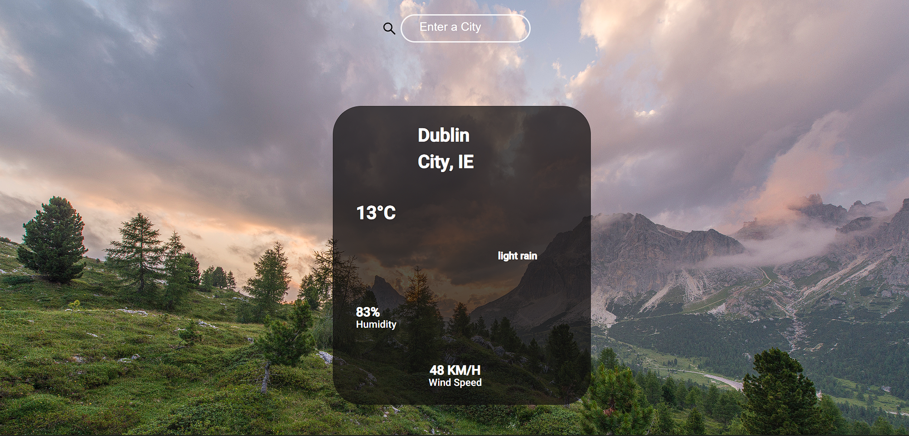

#### Weather App created in React Javascript for users to view the weather in all countries with the use of an API
## Website: link:https://636995f0487e0532625195cc--gorgeous-madeleine-44ff24.netlify.app/
Tech used: ReactJS
	
> ####	Here are the lists of taks done during this project:
> - used 'useState' hook
> - Used axios to make HTTP requst  
> - Created the location search using axios
> - Designed layout of how the weather would be displayed in index.css
> - Ask the user (in the container) to Input a location in the search bar
> - Displayed weather, used openweather JSON as template to find id's needed

#### Desktop view: 

#### Mobile View:

